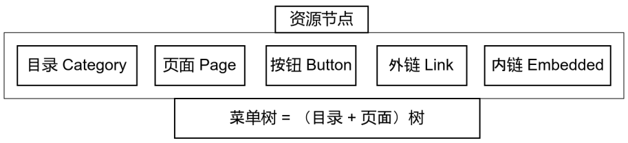
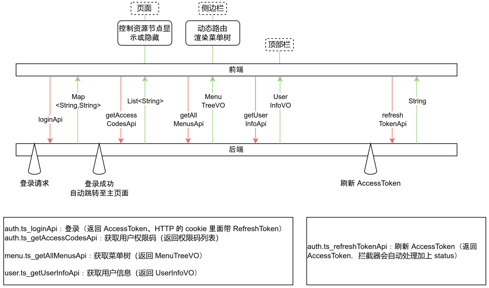

## 前端
- 将“菜单”与“资源节点”概念区分开
- 相较开源的 VbenAdmin,增加了用户组管理、资源节点管理
- 新增 `MultiCheck` 组件，在用户组管理中使用。用于实现 **用户组-用户** 以及 **用户组-角色** 的关联
- 根据功能，自定义设计并修改了 mock 后端（允许没有真实后端情况下单独运行，从而预览实际效果）
    - 对接前端 api 
    - 随机生成 mock 数据

开源 VbenAdmin 前端默认行为包括但不限：
- 动态路由
- 双 Token 验证机制




前端运行：
```bash
pnpm run dev
```
- 选择 `@vben/web-antd`


## 后端
- 完整的微服务架构体系
- JDK 17 + SpringBoot 3.x
- Nacos 注册/配置中心
- Dubbo RPC 内部通信
- JWT_AuthToken + RefreshToken 的（双 Token）登录安全机制    
- RBAC 菜单 + 权限码设计 
- MapStruct 实现 POJO 等类的相互映射
- Redis 维护登陆状态： (jti, userId)
    - JWT 机制允许多端登陆
- mysql 本地数据库存储
- Mybatis-plus 增强 ORM 框架
- mybatis-plus-generator 代码生成器

- common-core/common-web/common-rpc/common-infra 公告依赖模块
    - common-core 放置通用类和工具；common-web 放置 HTTP 处理类和工具；common-rpc 放置 dubbo_rpc 类和工具；common-infra 放置 SpringMVC 的通用基础配置
    - common-core 的 RedisUtils，common-web 的 GlobalExceptionHandler、JwtContextFilter、AccessCheckAspect 等类实现自动配置
- 双层状态码：HTTP 状态码、业务状态码（写在HTTP body）
- SpringMVC 统一正常返回（`Controller + ApiResponse<T>`）
- SpringMVC 统一异常处理（业务异常 `BizEeception`，全局异常处理封装为 `ApiResponse<T>`）    
- 自定义鉴权 AOP（authCodes 权限码粒度功能鉴权）
- JWT 的 tokenPayload 保存权限信息，供微服务解析、查询、比对
- 自定义 JWTUtils、RedisUtils 等工具类
    - JWTUtils 含以下功能：创建 JWT、验证 JWT（合法性与正确性）、解析 JWT 取出 TokenPayload
    - RedisUtils 不使用 JDK 序列化与反序列化；定义存取 String 与存取一般对象的办法（手动序列化为 JSON）
- 自定义 JwtContextFilter，依赖 `common-web` 即自动配置
    - 将拦截 HTTP 请求并解析 JWT，将用户信息存入上下文
    - ThreadLocal 保证上下文生命周期与线程安全
    - 白名单放行 `/auth/register` `/auth/login` `/auth/refresh`
- gateway-service（基于 Webflux）：请求 URI 预处理、路由、白名单、验证 accessToken
    - URI 预处理：裁剪 `/api` 前缀
    - 白名单放行 `/auth/register` `/auth/login` `/auth/refresh`
- auth-service（基于 SpringMVC）：
    - 注册、登录、登出、刷新 accessToken 、获取权限码 authCodes
    - BCrypt 密码加密存储
- user-service（基于 SpringMVC）：
    - 查询用户画像；用户业务的增删改查
    - 用户组业务的增删改查
- rbac-service（基于 SpringMVC）
    - 角色业务的增删改查
    - 资源节点业务的增删改查
- department-service（基于 SpringMVC）
    - 部门业务的增删改查
- 审计系统（在学了在学了...）

> [!TIP] 项目使用 maven wrapper 构建与运行

```bash 
./mvnw clean install -Dskiptests
./mvnw -pl xxx-service spring-boot:run
```
#### 主要的 request、vo 设计
据 VbenAdmin （他人开源前端）进行设计适配
- 自定义并根据创建/修改表单（FormSchema），设计 createRequest
- 自定义并根据查询条件（GridFormSchema），设计 queryRequest
- 自定义并根据显示表格（ColumnSchema），设计列表页 vo

#### 业务哲学
列表页快速加载，详情页（表单、或称编辑页）完整加载，两者查询 api 分离（`/xxList` 和 `/xxDetail`）


##### 增删改查要点总结
整体查 GET（queryRequest）
- 分页查询
- 带条件查询（表里自带的条件，其他表关联过来的条件）

具体查 GET（@PathVariable id）

增 POST（@RequestBody createRequest）
- 先查判断是否存在 + 带条件增（表里自带的条件/其他表关联过来的条件）

改 PUT（@PathVariable id,@RequstBody updateRequest）
- 先查判断是否存在 + 带条件改（表里自带的条件/其他表关联过来的条件）
- 当前状态改成 **明确给定的目标状态** 逻辑：获取目标状态并查询现状、集合化、差分、执行更新（即插入项或删除项）

删 DELETE（@PathVariable id）
- 保有 status 状态（逻辑删除）与物理删除两种手段
- 对于用户表 sys_user 不删除超级管理员与 status =1 （已启用）的记录
- 物理删除情况下：删除关联表，再删除自身（可以使用 **领域事件** 思想，让日后新增表自行订阅删除）


## sql 表
根据 VbenAdmin 提供的 api 返回数据与自定义需求，设计了数据表
